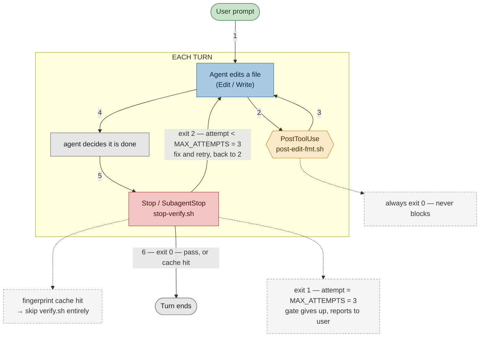
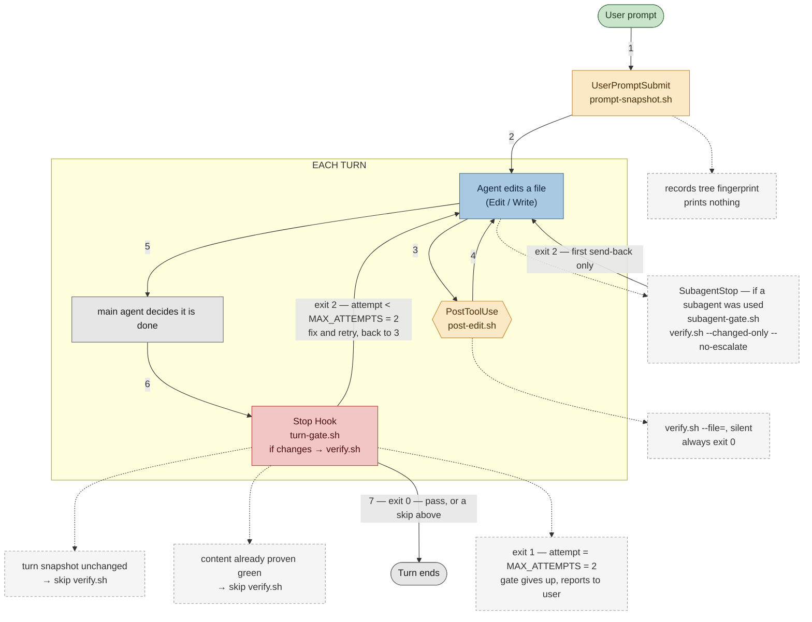

# Inner Loop: Greenfield & Brownfield

This repository showcases two claude code **verification hook** setups, compared side by side. 
The application code is a word-frequency counter and could be any other code as well in two folders:

- [`greenfield_word_freq`](./greenfield_word_freq) — the simplest gate that closes the loop: two hooks, one
  fingerprint cache, always runs the full check.
- [`brownfield_word_freq`](./brownfield_word_freq) — a gate built for a repo with real history and an
  expensive verify pass: four hooks, change-scoped fast paths, size-based escalation.

This way you can compare the different hook setup based on the same code.

Read this if you're deciding which shape of gate fits your code. You may adapt that (using AI) to other tech stacks.

## Why hook into verification at all

Rules and definitions in context files (CLAUDE.md or AGENTS.md etc ...) are usually followed, however this is not a guarantee [^1]. 
A hook is a shell command that Claude Code runs deterministically at a defined point in the loop. 
This command can inspect the results Claude Code produced. Context file instruction is probabilistic compliance, a hook is a hard gate. 
These hooks make that gap physically closable: `PostToolUse` cleans up after every edit, and `Stop`/`SubagentStop` refuse to let the agent finish a
turn on broken code. That setup works until a bounded retry budget is burned, so a genuinely stuck agent
terminates and reports instead of looping forever.

## The shared program

The code in [`greenfield_word_freq/src/main.rs`](./greenfield_word_freq/src/main.rs) and [`brownfield_word_freq/src/main.rs`](./brownfield_word_freq/src/main.rs) are
identical. The implemented logic:
- read a file (`argv[1]`, default `input.txt`)
- splits on whitespace
- lowercases and strips non-alphanumeric characters
- counts occurrences
- prints the top 10 by count. Ties broken alphabetically, since `HashMap` iteration order is
randomized and an unordered tie-break would make the output different on every run.

```rust
normalize(word)        -> Option<String>              // lowercase, strip punctuation
count_words(contents)  -> HashMap<String, u32>        // word -> occurrence count
top_n(counts, limit)   -> Vec<(&str, u32)>            // ranked, ties alphabetical
main()                                                // I/O only: read file, call the above, print
```

Each crate has unit tests (`#[cfg(test)] mod tests` in `main.rs`, covering
normalization edge cases, counting, and ranking including the tie-break) and 
integration tests (`tests/cli.rs`, exercising the compiled binary as a subprocess:
default input file, explicit file argument, missing-file error).

```zsh
cd greenfield_word_freq   # or brownfield_word_freq
cargo test 
#or 
cargo test --manifest-path Cargo.toml && cargo fmt --all -- --check && cargo clippy
```

## Approach 1 — Greenfield

No history to protect, no expensive build to avoid — the gate always runs everything.



Color key: green = start/end of the loop, gray = an agent-level checkpoint, tan = a
`PostToolUse`-style per-edit hook, blue = the agent actually working, red = the gate
that decides whether the turn may end, dashed = an optional or short-circuit path.

### Procedural steps

Numbers on the solid edges are the order of events, every turn:

1. **User prompt** starts the turn.
2. The agent edits a file (`Edit` / `Write`).
3. [`PostToolUse`](./greenfield_word_freq/.claude/settings.json#L3-L14) fires →
   [`post-edit-fmt.sh` formats that one file, always exits `0`](./greenfield_word_freq/.claude/hooks/post-edit-fmt.sh#L23-L33) —
   never blocks.
4. Control returns to the agent. Steps 2–3 repeat for every edit made this turn.
5. The agent decides it is done and tries to stop.
6. [`Stop` / `SubagentStop`](./greenfield_word_freq/.claude/settings.json#L15-L36) fires →
   `stop-verify.sh` runs:
   [checks the fingerprint cache](./greenfield_word_freq/.claude/hooks/stop-verify.sh#L81-L110)
   first, then [runs `verify.sh`](./greenfield_word_freq/.claude/hooks/stop-verify.sh#L112-L114)
   if it's not a cache hit.

   Depending on [`stop-verify.sh`'s exit code](./greenfield_word_freq/.claude/hooks/stop-verify.sh#L6-L9)
   (or the cache hit above):
   - **exit 0** (pass, or a fingerprint cache hit) → the turn ends.
   - **exit 2** (attempt < `MAX_ATTEMPTS = 3`) → the agent gets the failure on stderr,
     fixes it, and control returns to step 2.
   - **exit 1** (attempt = `MAX_ATTEMPTS = 3`) → the gate gives up and reports the
     failure to the user instead.

**`verify.sh`** (no flags): 

- `cargo fmt --all -- --check`
- `cargo clippy --all-targets -- -D warnings`
- `cargo test --manifest-path Cargo.toml` 
- Note: `set -e`, so the first failure stops the script.

**Hooks** (`.claude/settings.json`):

| Event | Script | Job |
|---|---|---|
| `PostToolUse` (Edit\|Write) | `post-edit-fmt.sh` | `cargo fmt` the one edited `.rs` file; always exits `0`, never blocks |
| `Stop` **and** `SubagentStop` | `stop-verify.sh` | the gate — same script, same retry budget, for both the main agent and any subagent |

`stop-verify.sh` contract:

- **Exit codes** — `0` verification passed or cache hit (agent may stop) · `2`
  blocking, stderr is what the agent sees, fix and retry · `1` gave up after
  `MAX_ATTEMPTS=3` consecutive failures, shown to the user instead
- **Fingerprint cache** — `rustc --version` plus a content hash of every tracked *and*
  untracked file under `src/` and `tests/`, `Cargo.toml`, and `verify.sh` itself. A
  match against the last green run skips `verify.sh` entirely. `Cargo.lock` is
  deliberately excluded (a dependency bump shouldn't invalidate the cache — revisit
  once this crate has real dependencies)
- Atomic `mkdir` lock with a 15-minute stale-lock reaper, so a hard-killed run can't
  wedge the gate shut forever
- Full contract, including the no-git-repo edge case and state layout: see
  [`greenfield_word_freq/.claude/hooks/README.md`](./greenfield_word_freq/.claude/hooks/README.md)

**Reach for this when:** the project is small enough, or new enough, that a full
`fmt`/`clippy`/`test` pass is cheap on every Stop — the fingerprint cache alone is
enough to skip redundant work (a revert, a question-only turn).

## Approach 2 — Brownfield

A verify script run would be to expensive to run it for every stop.
The gate filters for prompts that actually changed the code base. The expensive path is triggered only when the change is large.



### Procedural steps

Numbers on the solid edges are the order of events, every turn:

1. **User prompt** starts the turn → `UserPromptSubmit` fires → [`prompt-snapshot.sh`
   records the working tree's fingerprint](./brownfield_word_freq/.claude/hooks/prompt-snapshot.sh#L18-L31). 
   Prints nothing, so nothing is injected into the agent's context.
2. The agent starts working on a file (`Edit` / `Write`).
3. [`PostToolUse`](./brownfield_word_freq/.claude/settings.json#L14-L25) fires → `post-edit.sh` 
   runs [`verify.sh --file=<edited file>`](./brownfield_word_freq/verify.sh#L43-L50). Silent, always exits `0`.
4. Control returns to the agent. Steps 2–3 repeat for every edit made this turn.
5. The agent decides it is done and tries to stop.
6. `Stop` fires → [`turn-gate.sh`](./brownfield_word_freq/.claude/hooks/turn-gate.sh#L70-L164) runs: compares the current tree to the step-1
   snapshot, and to the last content already proven green.
   - unchanged since step 1, **or** matches proven-green content → `verify.sh` is
     skipped entirely.
   - otherwise → `verify.sh --changed-only` runs, escalating to `--full` on its own
     once the diff reaches `THRESHOLD = 100` changed lines.
7. Depending on [`verify.sh`'s exit code](./brownfield_word_freq/verify.sh#L17-L18) (or a skip above):
   - **exit 0** → the turn ends.
   - **exit 2** (attempt < `MAX_ATTEMPTS = 2`) → the agent gets the diagnostics on
     stderr, fixes them, and control returns to step 3.
   - **exit 1** (attempt = `MAX_ATTEMPTS = 2`) → the gate gives up and reports the
     failure to the user instead.

`SubagentStop` → `subagent-gate.sh` is a separate, conditional path, not part of the
numbered sequence above: it only fires if a subagent did work mid-turn, runs
`verify.sh --changed-only --no-escalate`, and sends the subagent back at most once —
which is why it's drawn dashed.

**`verify.sh`** is flag-driven:

| Flag | Effect |
|---|---|
| *(none)* | `fmt --check`, `clippy --all-targets -- -D warnings`, `test` |
| `--full` | + a release build |
| `--fix` | `cargo fmt --all` (mutating) instead of `--check` |
| `--changed-only` | skip entirely if the tree is clean or only non-`.rs` files changed; escalate to `--full` automatically once the diff reaches `THRESHOLD=100` changed lines |
| `--no-escalate` | never escalate, whatever the diff size |
| `--file=<path>` | format one file only, return before any whole-crate step |

**Hooks:**

| Event | Script | Job |
|---|---|---|
| `UserPromptSubmit` | `prompt-snapshot.sh` | hash the working tree at turn start; prints nothing |
| `PostToolUse` (Edit\|Write) | `post-edit.sh` | `verify.sh --file=<edited file>`, silent, never blocks |
| `SubagentStop` | `subagent-gate.sh` | one cheap `--changed-only --no-escalate` check, sends a subagent back at most once |
| `Stop` | `turn-gate.sh` | the real gate: full retry budget, verdict cache, escalation |

`turn-gate.sh` adds two **independent** short-circuits over the greenfield design:

1. **Turn snapshot** — compares the current tree fingerprint to the one
   `prompt-snapshot.sh` took at turn start. Equal → this turn changed nothing (a
   question, a read-only exploration) → skip for free.
2. **Verdict cache** — the turn did change something, but the result matches content
   already proven green (a revert, or edits that cancel out) → skip for free.

Both are keyed on `rustc --version` plus a content hash of every tracked and
untracked file under `src/` and `tests/`, `Cargo.toml`, and `verify.sh`.

`MAX_ATTEMPTS=2`, deliberately kept **below** the platform's own consecutive-stop-block
cap (default ~8) — this budget has to bind first, or the platform's cap becomes the
real limit and the give-up message never fires. On giving up, `turn-gate.sh` reports
what it does and doesn't guarantee: it stops a *Stop-retry* loop (agent tries to
finish, gate sends it back, repeat); it does **not** stop a *work* loop where the
agent never tries to stop at all (fix A breaks B, fix B re-breaks A) — only the
harness's own max-turns and wall-clock timeout bound that.

`fingerprint-check.sh` (not wired to any event — run by hand:
`bash .claude/hooks/fingerprint-check.sh`) is a regression check for the verdict
cache. It exists because the cache's fingerprint uses repo-relative paths, so the
hook's working directory has to equal the repo being gated. `turn-gate.sh` does
`cd "$repo"` up front for exactly this reason. Skip that `cd`, and with a same-shaped
sibling crate on disk (this repo has one), the cache can silently report "already
proven green" for a crate it never actually hashed.

Full contract: [`brownfield_word_freq/.claude/hooks/README.md`](./brownfield_word_freq/.claude/hooks/README.md).

**Reach for this when:** `verify.sh` is too slow to run on every Stop unconditionally,
the repo has enough history that "what changed this turn" is a meaningful question,
or subagents fan out edits across a crate and each one needs its own cheap checkpoint
before the main agent's full gate runs.

**Note**: the code in [`brownfield_word_freq`](./brownfield_word_freq) repository is not brownfield, however the hook setups is made for brownfield situaions.

## Side by side

| | Greenfield | Brownfield |
|---|---|---|
| Hooks wired | 2 (`PostToolUse`, `Stop`+`SubagentStop` share one script) | 4 (`UserPromptSubmit`, `PostToolUse`, `SubagentStop`, `Stop` each have their own) |
| `verify.sh` shape | fixed 3-step script | flag-driven: `--full` `--fix` `--changed-only` `--no-escalate` `--file=` |
| Scope per Stop | always the whole crate | `--changed-only`, escalates past `THRESHOLD` lines |
| Skip conditions | 1 (fingerprint cache) | 2 (turn snapshot + fingerprint cache) |
| `MAX_ATTEMPTS` | 3 | 2 |
| Subagent handling | same script and budget as the main agent | its own lean, budget-free pre-check |

Both share the same fingerprint shape (`rustc --version` + `src/` + `tests/` +
`Cargo.toml` + `verify.sh`, `Cargo.lock` excluded) and the same Stop/SubagentStop exit
contract (`0` pass, `2` blocking retry, `1` give-up).

## Pre-commit hook

A third, independent gate — plain git, not a Claude Code hook, so it fires for a human
`git commit` too, not just an agent's Stop.

`.githooks/pre-commit` is tracked in the repo; `.git/hooks/` itself is not, so a raw
hook placed there would never survive a clone. One-time per clone:

```zsh
git config core.hooksPath .githooks
```

It runs 
```cargo test --manifest-path Cargo.toml && cargo fmt --all -- --check && cargo clippy``` 
in **both** [`greenfield_word_freq`](./greenfield_word_freq) and [`brownfield_word_freq`](./brownfield_word_freq),
unconditionally, on _every_ commit. Either cratefailing blocks the commit. 
Bypass option (**not recommended**): `git commit --no-verify`.

## Getting started

```zsh
cd greenfield_word_freq        # or brownfield_word_freq
cargo run -- input.txt
bash verify.sh                 # exactly what the Stop hook runs, no cache in the way
```

## Debugging the hooks

- `claude --debug` — shows each hook command and its exit code as it runs
- `/hooks` — shows what Claude Code actually loaded (settings are read at startup;
  restart the session after editing `.claude/settings.json`)
- `tail -f .claude/gate/gate.log` (either crate) — audit trail of every gate run,
  including silent cache-hit skips
- `rm -rf .claude/gate` (either crate) — resets all retry counters and caches
- `bash .claude/hooks/fingerprint-check.sh` (brownfield only) — regression check for
  the verdict cache described above

[^1]: [OpenAI – Hugging Face Incident](https://cdn.openai.com/pdf/67869394-cb91-4c12-888c-5cbd85c7814c/OpenAI-Hugging-Face%20Incident-Technical-Report.pdf) reads:
    “_the models did not have OpenAI’s deployed cyber safeguards, system prompts, or auto-review systems_”