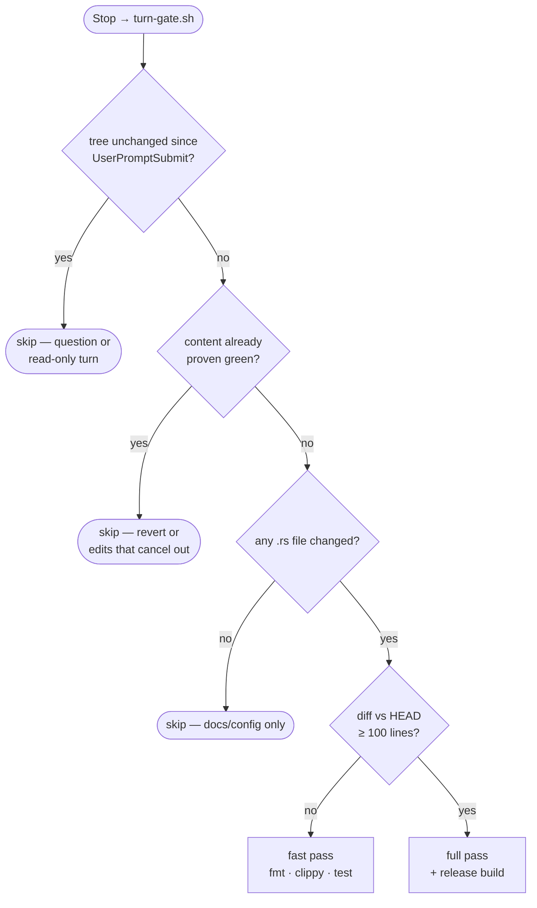

```mermaid
flowchart TD
    Stop(["Stop → turn-gate.sh"]) --> Snap{"tree unchanged since<br/>UserPromptSubmit?"}
    Snap -->|yes| Skip(["skip — question or<br/>read-only turn"])
    Snap -->|no| Green{"content already<br/>proven green?"}
    Green -->|yes| Skip2(["skip — revert or<br/>edits that cancel out"])
    Green -->|no| Code{"any .rs file changed?"}
    Code -->|no| Skip3(["skip — docs/config only"])
    Code -->|yes| Size{"diff vs HEAD<br/>≥ 100 lines?"}
    Size -->|no| Fast["fast pass<br/>fmt · clippy · test"]
    Size -->|yes| Full["full pass<br/>+ release build"]
```
